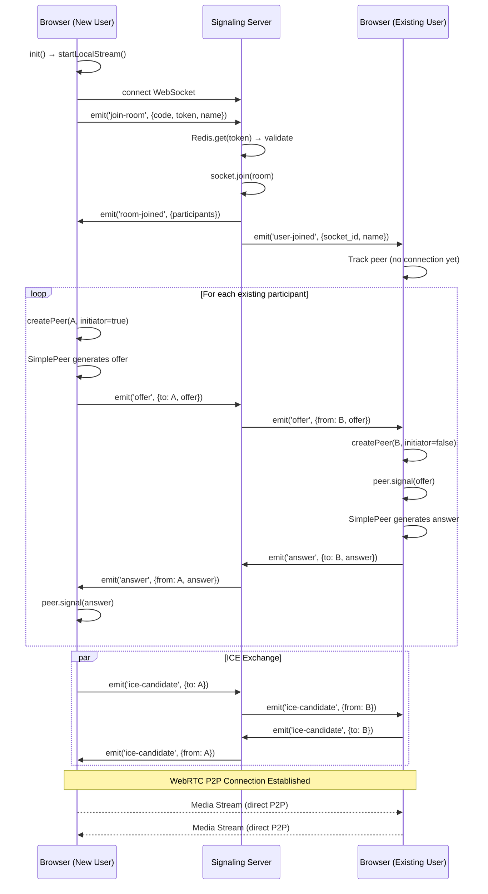

# WebRTC Connection Establishment Code Flow

## Metadata
| Field | Value |
|-------|-------|
| Repository | `cowork-claude` |
| Commit | `NO_COMMITS` (uncommitted) |
| Documented | `2026-01-01` |
| Trigger | User joins room via lobby, receives `room-joined` event with existing participants |
| End State | Bidirectional video/audio stream established between peers |

## Verification Summary
- [VERIFIED]: 28 claims
- [INFERRED]: 4 claims
- [NOT_FOUND]: 0 items

---

## Flow Diagram

```
[User A already in room]                    [User B joins room]
         │                                           │
         │                                           ▼
         │                               init() → startLocalStream()
         │                                           │
         │                                           ▼
         │                               connectSocket() → io(signalingUrl)
         │                                           │
         │                                           ▼
         │                               socket.emit('join-room')
         │                                           │
         │              ┌────────────────────────────┘
         │              ▼
         │     [Signaling Server]
         │     join-room handler
         │              │
         │              ├──→ Redis token validation
         │              ├──→ socket.join(room_code)
         │              ├──→ rooms.set(socket.id)
         │              │
         │              ├──→ socket.emit('room-joined') ──────────────────┐
         │              │                                                  │
         │◄─────────────┼──→ socket.to(room).emit('user-joined')          │
         │              │                                                  │
         ▼              │                                                  ▼
peers[B] tracked        │                               'room-joined' received
(no peer created)       │                                          │
         │              │                                          ▼
         │              │                               forEach existing participant:
         │              │                                 createPeer(A, initiator=true)
         │              │                                          │
         │              │                                          ▼
         │              │                               SimplePeer(initiator: true)
         │              │                                          │
         │              │                                          ▼
         │              │                               peer.on('signal') → offer
         │              │                                          │
         │              │                               socket.emit('offer', {to: A})
         │              │                                          │
         │              └──────────────────────────────────────────┘
         │                                                         │
         │◄──────────────── server relays offer ◄──────────────────┘
         │
         ▼
'offer' received
         │
         ▼
handleOffer(from=B)
         │
         ▼
createPeer(B, initiator=false)
         │
         ▼
SimplePeer(initiator: false)
         │
         ▼
peer.signal(offer)
         │
         ▼
peer.on('signal') → answer
         │
         ▼
socket.emit('answer', {to: B})
         │
         └──────────────────────────────────────────────────────────┐
                                                                    │
         [Server relays answer] ────────────────────────────────────┘
                                                                    │
                                                                    ▼
                                                         'answer' received
                                                                    │
                                                                    ▼
                                                         handleAnswer(from=A)
                                                                    │
                                                                    ▼
                                                         peer.signal(answer)
                                                                    │
                     ┌──────────────────────────────────────────────┘
                     │
                     ▼
         [ICE Candidates exchanged bidirectionally via signaling server]
                     │
                     ▼
         peer.on('connect') ────────────────────────── peer.on('connect')
                     │                                          │
                     ▼                                          ▼
         peer.on('stream') ◄═══════ WebRTC P2P ═══════► peer.on('stream')
                     │              Media Flow                   │
                     ▼                                          ▼
         video.srcObject = stream                   video.srcObject = stream
```

---

## Detailed Flow

### Step 0: Prerequisites - Library Loading

[VERIFIED: resources/views/components/layouts/app.blade.php:8]
```html
<script src="https://unpkg.com/simple-peer@9.11.1/simplepeer.min.js"></script>
```
SimplePeer loaded via CDN, exposes global `SimplePeer` constructor.

[VERIFIED: resources/js/app.js:3-6]
```javascript
import { io } from 'socket.io-client';

// Expose globally for inline scripts
window.io = io;
```
Socket.io client bundled via Vite, exposed as `window.io`.

---

### Step 1: Room Initialization

[VERIFIED: resources/views/room.blade.php:171-179]
```javascript
async init() {
    if (!this.token) {
        window.location.href = '/room/{{ $room->code }}/lobby';
        return;
    }

    await this.startLocalStream();
    this.connectSocket();
},
```

**Precondition:** Token exists in sessionStorage (set during room creation or join)
**Calls:** `startLocalStream()`, then `connectSocket()`

---

### Step 2: Local Media Stream Acquisition

[VERIFIED: resources/views/room.blade.php:181-201]
```javascript
async startLocalStream() {
    try {
        // Check if mediaDevices is available (requires HTTPS or localhost)
        if (!navigator.mediaDevices || !navigator.mediaDevices.getUserMedia) {
            console.warn('getUserMedia not available - site must be served over HTTPS or localhost');
            this.videoEnabled = false;
            this.audioEnabled = false;
            return;
        }

        this.localStream = await navigator.mediaDevices.getUserMedia({
            video: this.videoEnabled,
            audio: this.audioEnabled,
        });
        this.$refs.localVideo.srcObject = this.localStream;
    } catch (e) {
        console.error('Failed to get local stream:', e);
        this.videoEnabled = false;
        this.audioEnabled = false;
    }
},
```

**Browser API:** `navigator.mediaDevices.getUserMedia()`
**Data out:** `MediaStream` stored in `this.localStream`
**Note:** Requires HTTPS or localhost for browser security

---

### Step 3: Socket.io Connection

[VERIFIED: resources/views/room.blade.php:203-216]
```javascript
connectSocket() {
    this.socket = io('{{ $signalingUrl }}', {
        path: '/socket.io/',
        transports: ['websocket', 'polling'],
    });

    this.socket.on('connect', () => {
        console.log('Socket connected');
        this.socket.emit('join-room', {
            room_code: '{{ $room->code }}',
            token: this.token,
            display_name: this.displayName,
        });
    });
```

**Connects to:** Signaling server at `$signalingUrl` (e.g., ngrok tunnel)
**Emits:** `join-room` event with authentication data

**Data out:**
```javascript
{
    room_code: string,      // 6-char room code
    token: string,          // UUID from Laravel API
    display_name: string    // User's chosen name
}
```

---

### Step 4: Server Token Validation

[VERIFIED: signaling/server.js:37-45]
```javascript
socket.on('join-room', async (data) => {
    const { room_code, token, display_name } = data;

    // Validate token with Redis (Laravel uses prefix 'flowsync-database-')
    const valid = await redis.get(`flowsync-database-room:${room_code}:token:${token}`);
    if (!valid) {
        socket.emit('error', { message: 'Invalid room token', code: 'INVALID_TOKEN' });
        return socket.disconnect();
    }
```

**Redis query:** `GET flowsync-database-room:{code}:token:{token}`
**On failure:** Emits error, disconnects socket
**On success:** Continues to room join

---

### Step 5: Server Room Join & Participant Tracking

[VERIFIED: signaling/server.js:47-56]
```javascript
    // Join socket.io room
    socket.join(room_code);
    socket.data.room_code = room_code;
    socket.data.display_name = display_name;

    // Track participants
    if (!rooms.has(room_code)) {
        rooms.set(room_code, new Map());
    }
    rooms.get(room_code).set(socket.id, { display_name });
```

**Socket.io:** Joins named room for broadcasting
**In-memory:** Stores participant in `rooms` Map

---

### Step 6: Server Sends room-joined to New User

[VERIFIED: signaling/server.js:67-75]
```javascript
    // Send current state to new user
    socket.emit('room-joined', {
        participants: Array.from(rooms.get(room_code).entries()).map(([id, data]) => ({
            socket_id: id,
            display_name: data.display_name,
        })),
        timer_state: Object.keys(timerState).length ? timerState : null,
        presenter: presenter,
    });
```

**Data out:**
```javascript
{
    participants: [
        { socket_id: string, display_name: string },
        // ... all current participants including self
    ],
    timer_state: object | null,
    presenter: string | null
}
```

---

### Step 7: Server Notifies Existing Users

[VERIFIED: signaling/server.js:77-81]
```javascript
    // Notify others
    socket.to(room_code).emit('user-joined', {
        socket_id: socket.id,
        display_name,
    });
```

**Broadcasts to:** All other sockets in the room
**Note:** Existing users receive this but do NOT create peer connections yet

---

### Step 8: Client Receives room-joined & Initiates Connections

[VERIFIED: resources/views/room.blade.php:218-235]
```javascript
this.socket.on('room-joined', (data) => {
    this.connected = true;
    console.log('Joined room with participants:', data.participants);

    // Update timer state
    if (data.timer_state) {
        this.updateTimer(data.timer_state);
    }

    this.presenter = data.presenter;

    // Connect to existing participants
    data.participants.forEach(p => {
        if (p.socket_id !== this.socket.id) {
            this.createPeer(p.socket_id, p.display_name, true);
        }
    });
});
```

**Key Logic:** New user initiates connections to ALL existing participants
**Calls:** `createPeer(socketId, displayName, initiator=true)` for each existing user

---

### Step 9: Existing User Receives user-joined (No Peer Yet)

[VERIFIED: resources/views/room.blade.php:237-245]
```javascript
this.socket.on('user-joined', (data) => {
    console.log('User joined:', data);
    // Don't create peer here - wait for their offer
    // Just track them in peers list
    if (!this.peers[data.socket_id]) {
        this.peers[data.socket_id] = { displayName: data.display_name, handRaised: false };
    }
    this.addSystemMessage(`${data.display_name} joined the room`);
});
```

**Important:** Does NOT create peer connection - waits for offer
**Rationale:** Avoids duplicate connections; new user is always the initiator

---

### Step 10: SimplePeer Creation (Initiator)

[VERIFIED: resources/views/room.blade.php:295-322]
```javascript
createPeer(peerId, displayName, initiator) {
    // Don't create duplicate peer connections
    if (this.peerConnections[peerId]) {
        console.log('Peer connection already exists:', peerId);
        return this.peerConnections[peerId];
    }

    console.log('Creating peer:', peerId, 'initiator:', initiator, 'hasStream:', !!this.localStream);

    this.peers[peerId] = { displayName: displayName || 'Unknown', handRaised: false };

    const config = {
        initiator,
        trickle: true,
        config: {
            iceServers: [
                { urls: 'stun:stun.l.google.com:19302' },
                { urls: 'stun:stun1.l.google.com:19302' },
            ]
        }
    };

    // Only add stream if we have one
    if (this.localStream) {
        config.stream = this.localStream;
    }

    const peer = new SimplePeer(config);
```

**SimplePeer config:**
| Option | Value | Purpose |
|--------|-------|---------|
| `initiator` | `true` for new user | Determines who creates offer |
| `trickle` | `true` | Send ICE candidates as discovered |
| `iceServers` | Google STUN | NAT traversal |
| `stream` | `localStream` | Attached media to send |

---

### Step 11: SimplePeer Signal Handler (Offer Generation)

[VERIFIED: resources/views/room.blade.php:324-333]
```javascript
peer.on('signal', (signal) => {
    if (peer.destroyed) return;
    if (signal.type === 'offer') {
        this.socket.emit('offer', { to: peerId, offer: signal });
    } else if (signal.type === 'answer') {
        this.socket.emit('answer', { to: peerId, answer: signal });
    } else if (signal.candidate) {
        this.socket.emit('ice-candidate', { to: peerId, candidate: signal });
    }
});
```

**Signal types:**
- `offer` - SDP offer (initiator only)
- `answer` - SDP answer (non-initiator only)
- ICE candidate - NAT traversal info

**Emits to server:**
```javascript
{ to: string, offer: RTCSessionDescriptionInit }  // or answer/candidate
```

---

### Step 12: Server Relays Offer

[VERIFIED: signaling/server.js:87-92]
```javascript
socket.on('offer', (data) => {
    socket.to(data.to).emit('offer', {
        from: socket.id,
        offer: data.offer,
    });
});
```

**Relay pattern:** Adds `from` field, forwards to target socket
**Data transformation:**
```javascript
// Incoming
{ to: "socketB", offer: {...} }

// Outgoing (to socketB only)
{ from: "socketA", offer: {...} }
```

---

### Step 13: Existing User Receives Offer

[VERIFIED: resources/views/room.blade.php:256-258]
```javascript
this.socket.on('offer', (data) => {
    this.handleOffer(data.from, data.offer);
});
```

---

### Step 14: Handle Offer - Create Non-Initiator Peer

[VERIFIED: resources/views/room.blade.php:363-372]
```javascript
handleOffer(from, offer) {
    console.log('Received offer from:', from);
    if (!this.peerConnections[from]) {
        this.createPeer(from, this.peers[from]?.displayName || 'Unknown', false);
    }
    const peer = this.peerConnections[from];
    if (peer && !peer.destroyed) {
        peer.signal(offer);
    }
},
```

**Key:** Creates peer with `initiator=false`
**Calls:** `peer.signal(offer)` to process the SDP offer

[INFERRED] SimplePeer internally:
1. Sets remote description from offer
2. Creates answer
3. Emits 'signal' event with answer

---

### Step 15: Answer Sent Back

Uses same signal handler (Step 11) but with `signal.type === 'answer'`

```javascript
this.socket.emit('answer', { to: peerId, answer: signal });
```

---

### Step 16: Server Relays Answer

[VERIFIED: signaling/server.js:94-99]
```javascript
socket.on('answer', (data) => {
    socket.to(data.to).emit('answer', {
        from: socket.id,
        answer: data.answer,
    });
});
```

---

### Step 17: Initiator Receives Answer

[VERIFIED: resources/views/room.blade.php:260-262]
```javascript
this.socket.on('answer', (data) => {
    this.handleAnswer(data.from, data.answer);
});
```

[VERIFIED: resources/views/room.blade.php:374-380]
```javascript
handleAnswer(from, answer) {
    console.log('Received answer from:', from);
    const peer = this.peerConnections[from];
    if (peer && !peer.destroyed) {
        peer.signal(answer);
    }
},
```

[INFERRED] SimplePeer sets remote description, completing SDP exchange

---

### Step 18: ICE Candidate Exchange

[VERIFIED: resources/views/room.blade.php:264-266]
```javascript
this.socket.on('ice-candidate', (data) => {
    this.handleIceCandidate(data.from, data.candidate);
});
```

[VERIFIED: resources/views/room.blade.php:382-387]
```javascript
handleIceCandidate(from, candidate) {
    const peer = this.peerConnections[from];
    if (peer && !peer.destroyed) {
        peer.signal(candidate);
    }
},
```

[VERIFIED: signaling/server.js:101-106]
```javascript
socket.on('ice-candidate', (data) => {
    socket.to(data.to).emit('ice-candidate', {
        from: socket.id,
        candidate: data.candidate,
    });
});
```

**Note:** ICE candidates are exchanged bidirectionally and may arrive before/during/after SDP exchange due to `trickle: true`

---

### Step 19: WebRTC Connection Established

[VERIFIED: resources/views/room.blade.php:345-347]
```javascript
peer.on('connect', () => {
    console.log('Peer connected:', peerId);
});
```

[INFERRED] At this point, the RTCPeerConnection has successfully negotiated and the data channel (if any) is open.

---

### Step 20: Remote Stream Received

[VERIFIED: resources/views/room.blade.php:335-343]
```javascript
peer.on('stream', (stream) => {
    console.log('Got stream from:', peerId);
    this.$nextTick(() => {
        const video = document.getElementById('video-' + peerId);
        if (video) {
            video.srcObject = stream;
        }
    });
});
```

**Final action:** Attaches received `MediaStream` to remote video element
**Video element:** `<video :id="'video-' + peerId">`

---

## External Calls

| Type | Target | Location | Payload |
|------|--------|----------|---------|
| WebSocket | Signaling server | room.blade.php:204 | Socket.io connection |
| Redis GET | Token validation | server.js:41 | `flowsync-database-room:{code}:token:{token}` |
| Browser API | getUserMedia | room.blade.php:191 | `{video: bool, audio: bool}` |
| STUN Server | Google | room.blade.php:311 | ICE gathering |

---

## Events Summary

| Event | Direction | Purpose | Payload |
|-------|-----------|---------|---------|
| `join-room` | Client → Server | Join room with auth | `{room_code, token, display_name}` |
| `room-joined` | Server → Client | Confirm join, send state | `{participants[], timer_state, presenter}` |
| `user-joined` | Server → Others | Notify of new user | `{socket_id, display_name}` |
| `offer` | Client ↔ Server ↔ Client | SDP offer relay | `{to/from, offer}` |
| `answer` | Client ↔ Server ↔ Client | SDP answer relay | `{to/from, answer}` |
| `ice-candidate` | Client ↔ Server ↔ Client | ICE candidate relay | `{to/from, candidate}` |

---

## State Machines

### Peer Connection States

```
[No Connection]
      │
      ▼ createPeer(initiator=true)
[Peer Created]
      │
      ▼ signal event (offer)
[Offer Sent]
      │
      ▼ answer received
[Answer Processed]
      │
      ▼ ICE complete
[Connected] ←──── peer.on('connect')
      │
      ▼ stream event
[Streaming] ←──── peer.on('stream')
```

### Signaling Protocol

```
Initiator (New User)              Server                    Responder (Existing)
      │                              │                              │
      │──── offer ──────────────────►│                              │
      │                              │──── offer ──────────────────►│
      │                              │                              │
      │                              │◄──── answer ─────────────────│
      │◄──── answer ─────────────────│                              │
      │                              │                              │
      │◄═══════════════ ICE Candidates (bidirectional) ════════════►│
      │                              │                              │
      ╠════════════════════ WebRTC P2P Established ════════════════╣
```

---

## Known Issues Found

### 1. Duplicate ICE Server Configuration
[VERIFIED: room.blade.php:310-313 and RoomController.php:153-156]
STUN servers are configured in two places:
- Frontend hardcoded in `createPeer()`
- Backend returned from `/api/rooms` endpoint

The frontend ignores the API response's `ice_servers` field.

### 2. No TURN Server Configuration
[VERIFIED: room.blade.php:310-313]
Only STUN servers configured. Connections may fail behind symmetric NAT without TURN.

### 3. No Connection Retry Logic
[VERIFIED: room.blade.php:349-351]
```javascript
peer.on('error', (err) => {
    console.error('Peer error:', peerId, err);
});
```
Errors are logged but no reconnection attempt is made.

### 4. Race Condition Possibility
[INFERRED] If `user-joined` arrives before `room-joined` completes processing, the new user might try to connect to a peer that doesn't have them in the participants list yet. Mitigated by the new user always being the initiator.

---

## Sequence Diagram (Mermaid)


